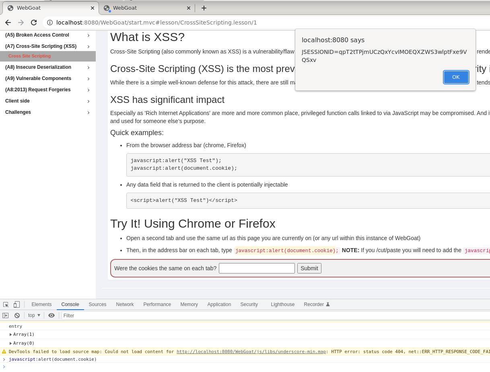

# H3, Third course week

In the third lesson we went through last weeks' homework. Injection attacks are easy to understand but it still wasn't that easy to do them if one does not write down the actual query you're making (i.e. "'SELECT salary FROM employee WHERE tan='113' OR '1'='1';--") and all the options you have already tried.

This week's homework ([course's website](https://terokarvinen.com/2021/data-security-2022p3-ict4tf022-3008/#h3)) includes reading about ATT&CK Framework and Cross Site Scripting (XSS). To understand XSS, we're to write a short story or a comic that describes the attack. Lastly, we learn hacking with WebGoat. 

## z - reading

**Assignment**

"Read and summarize (This subtask z does not require tests with a computer. Some bullets per article is enough for your summary, feel free to write more if you like)

* Mitre 2022: [ATT&CK Enterprise Matrix](https://attack.mitre.org/matrices/enterprise)
    * Give examples of a single, easy technique in each tactic. Which is the easiest?
    * Explain technique, subtechnique, tactic and procedure. Give example of each.
    * Describe a procedure (a brief description is enough, no need to repeat all steps listed)
* OWASP: [Cross Site Scripting (XSS)](https://owasp.org/www-community/attacks/xss/)"

**Notes and thoughts**

### ATT&CK:
* Question: Is this matrix a chain too like in the cyber kill chain, where the previous step has to succeed for the attack to be succesful? 
* "Tactics denoting short-term, tactical adversary goals during an attack (the columns)"([source](https://www.mcafee.com/enterprise/en-us/security-awareness/cybersecurity/what-is-mitre-attack-framework.html))
* "Techniques describing the means by which adversaries achieve tactical goals (the individual cells)"([source](https://www.mcafee.com/enterprise/en-us/security-awareness/cybersecurity/what-is-mitre-attack-framework.html))
* It looks like a subtechnique is a more narrow implementation (or an example?) of the ("super"-) technique, e.g. technique "Phishing" has a subtechnique "Spearphishing Attachment" and they're both under the "Initial Access"- tactic.
* Procedure examples seem to be either a group ([Transparent Tribe](https://attack.mitre.org/groups/G0134/)) or malware ([Valak](https://attack.mitre.org/software/S0476/)) that serves as an actual real-life example of a subtechnique that has been used. There seems to be a lot of procedures/examples for spearphishing attachments. I did not understand what the "steps" mentioned in the assignment would be in these procedure examples.
* Tactics:
    * Reconnaisance: information gathering
        * Technique: "Search Open Websites/Domains", probably the easiest technique in recon because it is just regular surfing and "stalking" to research what the target has been doing and saying, for example, in social media.
    * Resource Development: preparation phase for the attacker to set support measures for targeting, e.g. setting email acoounts for phishing 
        * Technique: The easiest techinque may be the "Obtain capabilities" where the attacker buys or steals malware that they're going to use against the target. 
    * Initial Access: getting into the target's network
        * Technique: "Replication Through Removable Media" may be the easiest if the attacker is proficient in social engineering. I feel like all the stories that I've heard about physical pentesting have included getting inside the target with charms and sticking an USB into a computer that is connected to the target network. On the other hand, "Phishing" might be the most commonly used, practically risk-free(?) and cheap, so, it might actually be the easiest tactic, Attacker can just send a malicious email with an attachment or a link.
    * Execution: running the malicious code
        * Technique: "User Execution" following "Phishing" is probably the easiest if attacker has made a succesfull succesful social engineering feat, then, the victim might just open the malicious attachment or follow the attacker's link to where-ever.
    * Persistence: maintaining presence in the network
        * Technique: This tactic has many techical techniques, so, it is hard for me to know what might be the easiest technique. I'm guessing that if an attacker is able to use "Valid Accounts"- technique, it is a preferable choice because it is hard to detect the attack with this technique.
    * Privilege Escalation: gaining higher-level permissions
        * This tactic seems to share quite many of the same techniques that the "Persistence"- tactic had. I'm guessing that if the attacker finds a vulnerability, they will use the "Exploitation for Privilege Escalation"-technique to gain higher-level permissions.
    * Defense Evasion: avoiding detection
        * Technique: Again, many very technical techniques but the easiest might still be the "Valid Accounts"- technique if there are default accounts left open and their credentials are well known and this technique might allow the attacker remain undetected. "Weaken Encryption"- technique seems very intresting but is probably hard to do.
    * Credential Access: stealing account names and passwords (with keylogging or credential dumping)
        * Technique: "Brute Forcing"- technique might be very easy technique, if the attacker does it without causing account locking and uses password guessing because many people use weak passwords still.
    * Discovery: figuring out the environment
        * Technique: All of the techniques seem to focus on an important thing to know about the target's network. Without knowing that much about the tools, I'm guessing "File and Directory Discovery" might be an easy technique because I imagine that it is a very common thing to check and there might be many ready-made attack tools for it.
    * Lateral Movement: moving in the environment
        * Technique: I think that "Internal Spearphishing" might be an easy technique because it involves tricking people with internal trusted account and usually, the people, are the weakest link in the security. On the other hand, if a target organization's worker gets suspicious of the internal accounts phishing attack, would it reveal that there is an attacker? So, is this a risky technique?
    * Collection: gathering intresting data
        *  Technique: I'm guessing that if the target has their own physical devices (instead of using Cloud Services), the easiest thing might be to use "Data from Local System" because there is probably the most valuable data collected to a single place. And if the target enterprise is not a huge company, they might not have a dedicated ICT team to look after the devices and since renewing the devices might be very expensive and difficult, they could be outdated or running old software, thus making them vulnerable to attack.
    * Command and Control: communicating with the compromised network from the outside
        * Technique: The "Remote Access Software"- techique might be the easiest way to communicate with the network because it might be used legitimately in the enterprise already and it allows the attacker to do whatever they want. I'm guessing that it might be easy to social engineer someone to install a remote access software.
    * Exfiltration: stealing data
        * Technique: I chose "Exfiltration Over Web Service"- technique because it gives cover to the data transfer against network traffic systems, though, I do not know if it is the easiest technique. 
    * Impact: manipulate, destroy and interrupt
        * Technique: I think "Defacement"- techniques might be easy because it doesn't take much to lose customer's trust, thus, causing a lot of damage to the target.

### XSS: 

* XSS happens when data enters web application through an untrusted source and is not validated and sanitized. This allows the attacker to inject their malicious code into the web application and results, often, to sensitive data exposure of the victim when they inadvertently give information or their cookies to the attacker when they visit the vulnerable website.
* Several kinds of XSS: stored, reflected, DOM-based

## y - Cross Site Story

**Assignment**

"Write a short story or draw a comic of a cross site scripting attack. Make roles clear: who attacks? Who runs, what code, where? What unauthorized access is gained? (This subtask y does not require any tests with a computer.)."

I have heard of XSS many times before, but never really understood how it actually happens, which is why I searched a video where someone demonstrates how the attack is done. I found Loi Liang Yang's YouTube- [video](https://www.youtube.com/watch?v=PPzn4K2ZjfY), "Cross-Site Scripting (XSS) Explained And Demonstrated By A Pro Hacker!". In the video he demonstrates the stored XSS- attack in WebGoat- environment and uses "Beef", which is a browser exploitation framework freely available. Here, I shortly explain what happens in the video that demonstrates the attack.

**Stored XSS - a Story**:

There was a hacker, named Phisher, who was surfing the vastness of the net and looking for an easy catch. They perused through many a product review-site and numerous message forums, poking here and there, and feeding the input fields with test scripts that have alerts. Until, at long last, a website hailed back at the Phisher and said "Hello World!" like they had waited. Now, a vulnerable input field had been found, a comment field that will run the Phisher's code, no questions asked. They rummaged their toolkit and found just the right thing, a browser exploitation framework called "Beef". "Beef" was a tool that every phisher worth their salt knew and shared with each other freely. Plenty of fish in the sea... "Beef" has many helpful features for a phisher, like graphic user interface in the browser and ready-made commands for several different phishing attacks among others. Phisher prepared their bait, a script- tag that had a catch, a hook.js- file from "Beef". Phisher clicked "Comment"-button, the website happily accepted and executed the code and stored the bait permanently in the database, where it would be found by anyone who came too close. Then started the waiting game. But it did not take long until someone else wanted to comment something and got hooked by the bait without them even noticing it. Fresh prey for the Phisher. The prey's unsuspecting browser had executed Phisher's hook-code because it came from a "trusted source", comment forum's own database. What a betrayal! Phisher smirked. They could see the victim's browser information in their "Beef"-interface, like victim's ip-address, language and plugins but it was some other information Phisher had in mind. They executed a social engineering command in "Beef", that made the message forum website to look like a Google account- login page. Phisher waited in suspense: "Will the prey fall for the fake login-page? Are they distrated enough?" Yes, they were! From their "Beef"-interface, Phisher could see their prize, the real Google login information, the username and the password, of the victim. What to do with this treasure?  

## a - WebGoat: A3 Sensitive Data Exposure

**Assignment**

* "Insecure Login: 2 Let's try"

Using the hints given in the assignment (and WebGoat suggested it too), I figured I should use a sniffing tool. I checked how to install Wireshark, just in case (https://linuxhint.com/install-wireshark-debian-11/). The tutorial did not explain the last question the installing process has: "Should non-superusers be able to capture packets?" and I chose "No" because I thought it is better to deny just in case because I was not 100%- sure what it meant. I tried to search for an explanation but did not find and figured I would just try the program like this. 

I followed a [tutorial](https://www.arbexam.blog/webgoat-a3-sensitive-data-exposure-walkthrough/) for this exercise because I've never used a sniffing tool before.

I tried to choose the "Loopback:lo"- option but got this error-message saying that I do not have the permissions:

So, did as the error-message suggested:

> sudo dpkg-reconfigure wireshark-common

Chose "Yes" and then:

> sudo usermod -a -G wireshark melissa

After which, I was able to choose the "Loopback:lo"- option and started recording network data moving.

In WebGoat- assignment, I just clicked the "Login" without typing anything into the fields. Then went to stop the recording in Wireshark.

Per tutorial, I used filter option "http.request.method" (I think the text had a typo "http.request.filter=="POST"" but the pictures had the one that worked), I left out the "=="POST""-part to get all http-requests and the results looked like this:

Recording showed all http-requests (GETs and POSTs) moving to/from localhost. The POST-requests are what we're after for the assignment. 

There were two POST-requests and the other had the requested username and password (see pictures below), in plain-text, which was the point: they were not encrypted and thus, I was able to find them and "abuse" them by logging in as "someone else". A bit too easy to "steal" confidential information if someone like me, a newbie, could just find them lying there.

## b - WebGoat: A7 Cross Site Scripting (XSS): Cross site scripting

**Assignment**

* "2 What is XSS?"
* "7 Try It! Reflected XSS"

Authentication cookies is data a web server has saved to the user's device. Then the browser can send it back to the server if needed. Cookies are used to remember information. Cookies are valuable data because if the attacker gets your cookie, they can, in a way, impersonate you to the server and gain access to your account with the cookie.

First assignment demonstrates that the WebGoat uses cookies and that it remembers me: both tabs have the same cookie (answer to the question is "yes").

From the Inspector-tool's console, I wrote the suggested "javascript:alert(document.cookie);" which gave me the same cookie-value in both tabs.

I could have found the cookies from the Inspector-tools Application-tab, from Cookies-menu.

WebGoat gives a list where these vulnerabilities are usually located:

In the next Reflected XSS- assignment, the attack is pictured like this:

Next, we're supposed to find a XSS- vulnerability in a web-shop form. After reading the hints, I found that the "three digit access code" input field had "type=TEXT", so it would accept something else than a number. I added a script-tag that made an alert and it went through (at least the top sign turned green).

The "credit card number" input field had text-type in it too, and using script-tag there worked too, though WebGoat mocked me by saying that alerts are not that impressive.

Exercises were quite time consuming (about 4 hours for reading and making notes, over an hour for the story and at least three hours for the WebGoat tasks) but I think I learned some new things. I did not explore Wireshark really and I left the other XSS- tasks in WebGoat for a later time.